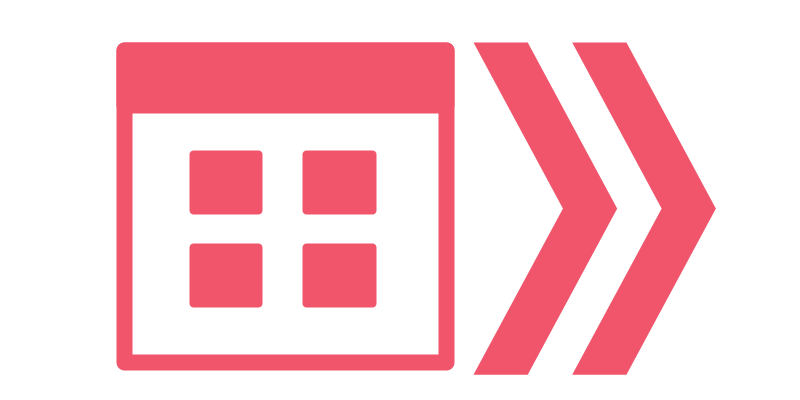

<p align="center">
    <br />
    
    
</p>

# uffs-ca-scraping

Um pacote PHP para raspagem dos calendários acadêmicos da [Universidade Federal da Fronteira Sul](https://www.uffs.edu.br). A ideia desse pacote é permitir que APIs sejam criadas com informações sobre datas importantes para a comunidade acadêmica, como rematrícula, fechamento de diário, etc.

## ✨Features

* Obtenção automática de informações dos calendários acadêmicos através da [listagem no site da UFFS](https://www.uffs.edu.br/institucional/pro-reitorias/graduacao/calendario-academico);
* Obtem um (ou todos) os calendários acadêmicos publicados no site;
* Não necessita de alterações para obter calendários futuros (que ainda serão publicados pela UFFS);
* Dados estruturados para facilitar a manipulação.

## 🚀 Utilização

### 1. Adicione o pacote ao seu projeto

Na pasta raiz do seu projeto PHP, rode:

```
composer require ccuffs/uffs-ca-scraping
```

Todas as dependências serão instaladas.

### 2. Obtenção de todos os calendários acadêmicos

Para obtem qualquer calendário acadêmico, você utilizará a classe `AcademicCalendarUFFS`. Um objeto dessa classe possui diversos métodos para obtenção de calendários.

O mais simples é a obtenção de todos os calendários já publicados:

```php
$ac = new \CCUFFS\Scrap\AcademicCalendarUFFS();
$calendars = $ac->fetchCalendars();
```

Nesse caso, `$calendars` será um vetor onde cada entrada é um calendário acadêmico (com informação do título dele, a URL onde ele foi obtido e os dados/datas referentes):

```php
array(3) {
    [0]=>
    array(3) {
      ["title"]=>
      string(193) "PORTARIA N 2042/GR/UFFS/2022 - Estabelece o ... para o ano letivo de 2022. "
      ["url"]=>
      string(61) "https://www.uffs.edu.br/atos-normativos/portaria/gr/2022-2042"
      ["data"]=>
      array(11) {
        ["ABRIL / 2022"]=> array(3) {
            ["month"]=>
            string(5) "Abril"
            ["events"]=>
            array(13) {
              [0]=>
              array(2) {
                ["period"]=>
                string(1) "8"
                ["event"]=>
                string(176) "Publicação dos editais com os resultados ..."
              }
              [1]=>
              array(2) {
                ["period"]=>
                string(7) "11 a 18"
                ["event"]=>
                string(195) "Período para matrícula dos selecionados ..."
              }
              ...
            }
        ["MAIO / 2022"]=> ...
        ["JUNHO / 2022"]=> ...
        ...
      }
    [1]=> 
    array(3) {
      ["title"]=>
      string(193) "PORTARIA N 1090/GR/UFFS/2021 - Estabelece o ... para o ano letivo de 2021."
      ["url"]=>
      string(61) "https://www.uffs.edu.br/atos-normativos/portaria/gr/2021-1090"
      ["data"]=>
      array(11) {
        ["JANEIRO / 2021"]=> ...
        ["FEVEREIRO / 2021"]=> ...
        ["MARÇO / 2021"]=> ...
        ...
      }
``` 

Esse método tende a retornar valores diferentes conforme os meses passem. Por exemplo, se a UFFS publicar um novo calendário acadêmico, uma nova entrada será retornada no vetor em questão.

### 3. Obtenção de um calendário acadêmico específico

Se você deseja obter um calendário acadêmico em específico, você pode usar a URL dele no site da UFFS para obter os dados:

```php
$ac = new \CCUFFS\Scrap\AcademicCalendarUFFS();
$calendar = $ac->fetchCalendarByUrl('https://www.uffs.edu.br/atos-normativos/portaria/gr/2022-2042');
```

A variável `$calendar` conterá os dados do calendário acadêmico em questão (o equivalente ao campo `data` de um calendário obtido com `fetchCalendars()`). Os índices são associativos e represetam o mês e ano do calendário. Por exemplo:

```php
array(11) {
    ["ABRIL / 2022"]=>
    array(3) {
      ["month"]=>
      string(5) "Abril"
      ["events"]=>
      array(13) {
        [0]=>
        array(2) {
          ["period"]=>
          string(1) "8"
          ["event"]=>
          string(176) "Publicação dos editais com os resultados de Transferência Interna e Retorno de Aluno-abandono da UFFS, Transferência Externa e Retorno de Graduado, para ingresso em 2022.1."
        }
        [1]=>
        array(2) {
          ["period"]=>
          string(7) "11 a 18"
          ["event"]=>
          string(195) "Período para matrícula dos selecionados no Processo Seletivo de Transferência Interna e Retorno de Aluno-abandono da UFFS, Transferência Externa e Retorno de Graduado, para ingresso em 2022.1"
        }
        [2]=>
        array(2) {
          ["period"]=>
          string(2) "14"
          ["event"]=>
          string(50) "TÉRMINO DO SEMESTRE LETIVO 2021.2 DA GRADUAÇÃO."
        }
        [3]=>
        array(2) {
          ["period"]=>
          string(7) "15 a 30"
          ["event"]=>
          string(31) "Período de recesso acadêmico."
        }
        [4]=>
        array(2) {
          ["period"]=>
          string(2) "18"
          ["event"]=>
          string(110) "Data limite para encerramento dos Diários de Classe on-line e entrega dos mesmos nas Secretarias Acadêmicas."
        }
        [5]=>
        array(2) {
          ["period"]=>
          string(10) "19/4 a 2/5"
          ["event"]=>
          string(132) "Período para destrancamento ou renovação de trancamento de matrícula da graduação para o semestre 2022.1, via Portal do Aluno."
        }
        [6]=>
        array(2) {
          ["period"]=>
          string(10) "19/4 a 2/5"
          ["event"]=>
          string(86) "Período de autoavaliação geral dos estudantes, TAEs, docentes e comunidade externa."
        }
        [7]=>
        array(2) {
          ["period"]=>
          string(11) "19/4 a 31/5"
          ["event"]=>
          string(84) "Período de preenchimento e aprovação do plano de ensino, via Portal do Professor."
        }
        [8]=>
        array(2) {
          ["period"]=>
          string(11) "19/4 a 31/5"
          ["event"]=>
          string(117) "Período para elaboração e entrega do Plano de Adaptações Curriculares ao estudante e ao Setor de Acessibilidade."
        }
        [9]=>
        array(2) {
          ["period"]=>
          string(7) "19 a 24"
          ["event"]=>
          string(70) "Período para rematrícula 2022.1 da graduação, via Portal do Aluno."
        }
        [10]=>
        array(2) {
          ["period"]=>
          string(7) "25 e 26"
          ["event"]=>
          string(66) "Período para análise dos pedidos de rematrícula da graduação."
        }
        [11]=>
        array(2) {
          ["period"]=>
          string(7) "25 a 29"
          ["event"]=>
          string(54) "Período de planejamento do ano letivo da graduação."
        }
        [12]=>
        array(2) {
          ["period"]=>
          string(10) "27/4 a 2/5"
          ["event"]=>
          string(96) "Período para solicitação de ajustes de matrícula 2022.1 da graduação, via Portal do Aluno."
        }
      }
      ["festivities"]=>
      array(2) {
        [0]=>
        string(46) "15 - Paixão de Cristo - Feriado Nacional."
        [1]=>
        string(39) "21 - Tiradentes - Feriado Nacional."
      }
    }
    ["MAIO / 2022"]=>
    array(3) {
      ["month"]=>
      string(4) "Maio"
      ["events"]=>
      array(14) {
        [0]=>
        array(2) {
          ["period"]=>
          string(10) "19/4 a 2/5"
          ["event"]=>
          string(132) "Período para destrancamento ou renovação de trancamento de matrícula da graduação para o semestre 2022.1, via Portal do Aluno."
        }
        [1]=>
        array(2) {
          ["period"]=>
          string(10) "19/4 a 2/5"
          ["event"]=>
          string(86) "Período de autoavaliação geral dos estudantes, TAEs, docentes e comunidade externa."
        }
        [2]=>
        array(2) {
          ["period"]=>
          string(11) "19/4 a 31/5"
          ["event"]=>
          string(84) "Período de preenchimento e aprovação do plano de ensino, via Portal do Professor."
        }
        [3]=>
        array(2) {
          ["period"]=>
          string(11) "19/4 a 31/5"
          ["event"]=>
          string(117) "Período para elaboração e entrega do Plano de Adaptações Curriculares ao estudante e ao Setor de Acessibilidade."
        }
        [4]=>
        array(2) {
          ["period"]=>
          string(10) "27/4 a 2/5"
          ["event"]=>
          string(96) "Período para solicitação de ajustes de matrícula 2022.1 da graduação, via Portal do Aluno."
        }
        [5]=>
        array(2) {
          ["period"]=>
          string(1) "2"
          ["event"]=>
          string(60) "INÍCIO DO SEMESTRE LETIVO 2022/1 DOS CURSOS DE GRADUAÇÃO."
        }
        [6]=>
        array(2) {
          ["period"]=>
          string(5) "3 e 4"
          ["event"]=>
          string(75) "Período para análise dos pedidos de ajustes de matrícula da graduação."
        }
        [7]=>
        array(2) {
          ["period"]=>
          string(6) "5 a 15"
          ["event"]=>
          string(68) "Período para inclusão extraordinária de CCR, via Portal do Aluno."
        }
        [8]=>
        array(2) {
          ["period"]=>
          string(6) "5 a 31"
          ["event"]=>
          string(88) "Período para solicitação de cancelamento de CCRs da graduação, via Portal do Aluno."
        }
        [9]=>
        array(2) {
          ["period"]=>
          string(1) "9"
          ["event"]=>
          string(181) "Data de publicação do edital do processo seletivo de Aluno-especial da graduação, se houver viabilidade de realização das inscrições devido aos efeitos da Pandemia Covid-19."
        }
        [10]=>
        array(2) {
          ["period"]=>
          string(7) "10 e 11"
          ["event"]=>
          string(87) "Período para inscrição no processo seletivo de Aluno-especial da graduação 2022/1."
        }
        [11]=>
        array(2) {
          ["period"]=>
          string(2) "17"
          ["event"]=>
          string(65) "Divulgação do resultado do processo seletivo de Aluno-especial."
        }
        [12]=>
        array(2) {
          ["period"]=>
          string(13) "18/05 a 02/07"
          ["event"]=>
          string(65) "Período para realização das formaturas dos concluintes 2021.2."
        }
        [13]=>
        array(2) {
          ["period"]=>
          string(7) "23 a 31"
          ["event"]=>
          string(78) "Período para solicitação de exame de suficiência na Secretaria Acadêmica."
        }
      }
      ["festivities"]=>
      array(1) {
        [0]=>
        string(51) "1 - Dia Mundial do Trabalho - Feriado Nacional."
      }
    }
}
```

## 👩‍💻 Desenvolvimento

Se você pretende criar features novas, corrigir bugs ou afins, siga o passo a passo abaixo.

Clone o repositório:

```
git clone https://github.com/ccuffs/uffs-ca-scraping && cd uffs-ca-scraping
```

Instale as dependências:

```
composer install
```

Implemente o que for necessário e rode os testes:

```
composer test
```

Em teoria todos os testes devem passar. Se algo existente estiver quebrando, muito provavelmente a UFFS atualizou o site e você precisará atualizar o pacote. Que fase, né?

## 🤝 Contribua

Sua ajuda é muito bem-vinda, independente da forma! Confira o arquivo [CONTRIBUTING.md](CONTRIBUTING.md) para conhecer todas as formas de contribuir com o projeto. Por exemplo, [sugerir uma nova funcionalidade](https://github.com/ccuffs/uffs-ca-scraping/issues/new?assignees=&labels=&template=feature_request.md&title=), [reportar um problema/bug](https://github.com/ccuffs/uffs-ca-scraping/issues/new?assignees=&labels=bug&template=bug_report.md&title=), [enviar um pull request](https://github.com/ccuffs/hacktoberfest/blob/master/docs/tutorial-pull-request.md), ou simplemente utilizar o projeto e comentar sua experiência.


## 🎫 Licença

Esse projeto é licenciado nos termos da licença open-source [MIT](https://choosealicense.com/licenses/mit) e está disponível de graça.

## 🧬 Changelog

Veja todas as alterações desse projeto no arquivo [CHANGELOG.md](CHANGELOG.md).

## 🧪 Projetos semelhates

Abaixo está uma lista de links interessantes e projetos similares:

* [uffs-sga-scraping](https://github.com/ccuffs/uffs-sga-scraping)
* [auth-iduffs](https://github.com/ccuffs/auth-iduffs)
* [dados-uffs](https://github.com/grintex/dados-uffs)
